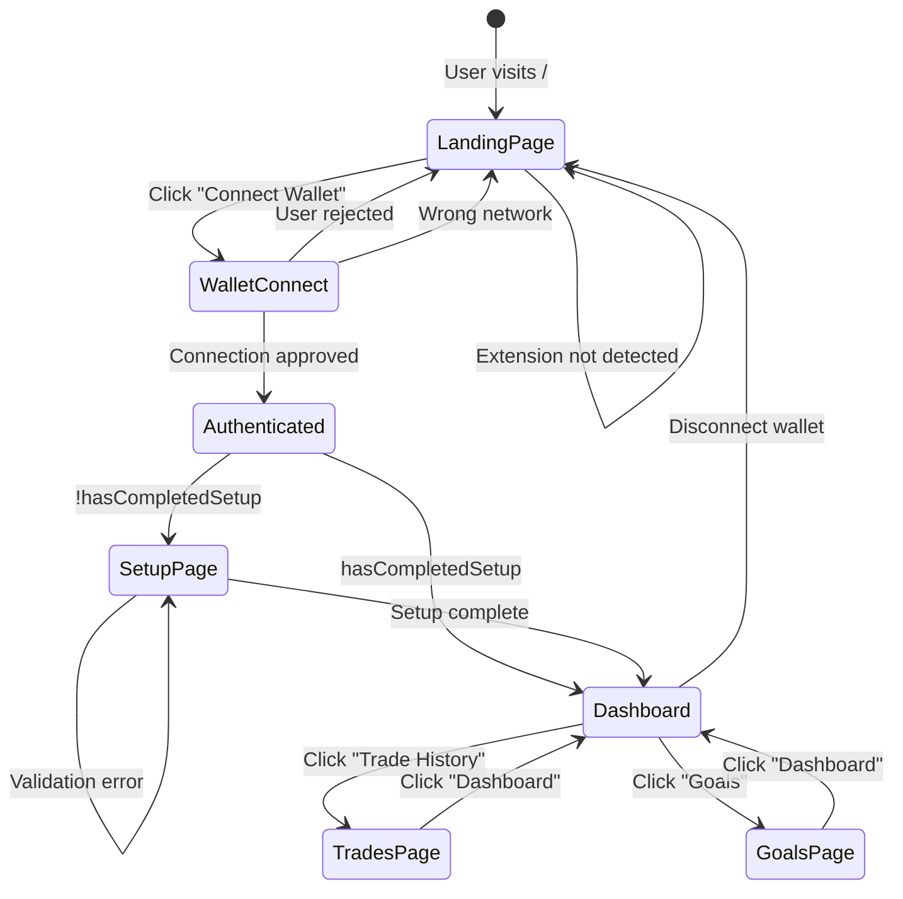

# Days 8-11 Technical Specification: Authentication & UI Architecture

## Version 1.0 | Status: Draft | Target: Implementation-Ready

---

## Executive Summary

This document provides complete UI/UX specifications for Days 8-11 of the Profit is Profit (PisP) development cycle, covering authentication flows, setup/onboarding UI, dashboard architecture, and navigation logic. Days 1-7 established the data layer, business logic, and Helius API integration. Days 8-11 focus exclusively on the user-facing interface layer.

---

## 1. Gap Analysis Summary

Based on audit of `@docs/roadmap.md` and supporting documentation, the following critical specifications are **missing or underspecified** in the existing roadmap:

### Missing from Day 8-9 (Wallet Setup Flow):

- **Authentication mechanism**: Roadmap assumes user exists with wallets but doesn't specify how user identity is established
- **Entry point for unauthenticated users**: No landing page or auth flow specified
- **Session management**: No explicit session handling, token refresh, or auth state persistence
- **Error states for wallet connection**: Extension not detected, rejected connection, wrong network
- **Mobile wallet connection**: Deep-link handling, mobile-specific UX

### Missing from Day 10-11 (Dashboard UI):

- **Navigation shell**: No specification for persistent navigation, header, or layout wrapper
- **Authentication guards**: No explicit route protection logic
- **Wallet connection status indicators**: Visual states for connected/disconnecting/error
- **Responsive behavior**: Mobile viewport specifications for wallet-heavy UI
- **Empty states**: What displays when no trades exist, wallet not connected

### Critical Oversights:

- **No explicit state machine**: No formal definition of `Unauthenticated → Auth → Setup → Dashboard` flow
- **Missing auth types**: Roadmap uses Supabase Auth but doesn't specify method (email vs wallet vs anonymous)
- **No component hierarchy**: Relationships between WalletCard, TierBadge, Dashboard unclear
- **No route protection strategy**: How to handle direct URL access to `/dashboard` without setup

---

## 2. Day 8: Authentication Infrastructure

### 2.1 Architecture Decision: Hybrid Auth Model

[ASSUMPTION: After analyzing the roadmap and database schema, a wallet-first authentication approach is optimal. The app tracks wallet addresses as the primary identity, making wallet connection the natural auth mechanism. Email/password is reserved as a technical fallback only if wallet implementation creates blocking debt.]

**Primary Authentication Method: Wallet-Based (Solana)**

- Users authenticate by connecting their Solana wallet (MetaMask with Solana snap, Phantom, Solflare, Backpack)
- Wallet address becomes the `user.id` in database (or linked via `wallets` table)
- No email/password required for core functionality
- Session persists via wallet connection state

**Technical Justification:**

1. Database schema (`users` table) has optional `email` field
2. MVP uses read-only wallet monitoring (no custody)
3. Target users are crypto-native traders
4. Wallet connection is prerequisite for app functionality

**Fallback (if wallet auth creates unresolvable blockers):**

- Anonymous Supabase Auth (auto-create user on first visit)
- Wallet addresses stored as app data, not auth identity
- Trade-off: Less seamless UX, requires separate session management

### 2.2 Authentication Flow State Machine

```
┌──────────────────┐
│   UNINITIALIZED  │ ← User visits app for first time
│   (No session)   │
└────────┬─────────┘
         │
         │ Detect wallet extension
         ▼
┌──────────────────┐     ┌──────────────────┐
│  WALLET_PROMPT   │────▶│  NO_EXTENSION    │
│ (Connect wallet) │     │   (Show install  │
└────────┬─────────┘     │    instructions) │
         │               └──────────────────┘
         │ User clicks "Connect"
         ▼
┌──────────────────┐     ┌──────────────────┐
│  CONNECTING      │────▶│ USER_REJECTED    │
│  (Waiting for    │     │ (Show error,     │
│   signature)     │     │  allow retry)    │
└────────┬─────────┘     └──────────────────┘
         │
         │ Signature approved
         ▼
┌──────────────────┐     ┌──────────────────┐
│  AUTHENTICATED   │────▶│ WRONG_NETWORK    │
│  (Wallet addr =  │     │ (Prompt switch   │
│   user identity) │     │  to mainnet)     │
└────────┬─────────┘     └──────────────────┘
         │
         │ Check if user has
         │ completed setup
         ▼
    ┌────────┐
    │ Setup  │
    │Complete?│
    └────┬───┘
   Yes /   \ No
      /     \
     ▼       ▼
┌────────┐ ┌────────┐
│DASHBOARD│ │ SETUP  │
│         │ │  FLOW  │
└────────┘ └────────┘
```

### 2.3 Authentication Entry Point: Landing Page

**Page Component:** `/app/page.tsx` (replaces current placeholder)

**States:**

1. **Unauthenticated View** (default)
   - Hero section with value proposition
   - "Connect Wallet" primary CTA (large button)
   - "How it works" secondary content
   - Footer with links to docs/about

2. **Extension Not Detected**
   - Modal overlay: "Wallet Extension Required"
   - Install links: Phantom, Solflare, Backpack
   - "I've installed it" retry button

3. **Connecting State**
   - Button shows spinner with "Connecting..."
   - Disable all other interactions
   - Wallet selection modal (if multiple wallets detected)

4. **Error: User Rejected**
   - Toast notification: "Connection rejected. Please approve in your wallet."
   - Return to Unauthenticated View with active CTA

5. **Error: Wrong Network**
   - Modal: "Switch to Solana Mainnet"
   - Instructions or auto-prompt if wallet supports
   - "Retry connection" button

### 2.4 Wallet Connection Component

**Component:** `src/components/auth/WalletConnectButton.tsx`

**Props Interface:**

```typescript
interface WalletConnectButtonProps {
  size?: 'sm' | 'md' | 'lg';
  variant?: 'primary' | 'secondary' | 'ghost';
  fullWidth?: boolean;
  onConnect?: (walletAddress: string) => void;
  onError?: (error: WalletError) => void;
}

type WalletError = 
  | { type: 'EXTENSION_NOT_FOUND'; message: string }
  | { type: 'USER_REJECTED'; message: string }
  | { type: 'WRONG_NETWORK'; message: string; currentNetwork: string }
  | { type: 'TIMEOUT'; message: string }
  | { type: 'UNKNOWN'; message: string };
```

**Key States:**

| State | Visual | Interaction |
|-------|--------|-------------|
| `idle` | "Connect Wallet" button | Click to initiate |
| `detecting` | Button disabled, "Detecting wallets..." | Waiting for wallet list |
| `select_wallet` | Wallet selection modal (Phantom, Solflare, etc.) | User selects provider |
| `connecting` | Button shows spinner, "Connecting..." | Waiting for signature |
| `connected` | Shows wallet address (truncated), green dot | Click to disconnect |
| `error` | Red error state with retry | Click to retry |

**Implementation Notes:**

- Use `@solana/wallet-adapter-react` for wallet abstraction
- Support wallet list: Phantom, Solflare, Backpack, Glow
- Mobile: Trigger wallet deep-links (phantom://, solflare://)
- Store connected wallet address in Zustand `auth-store.ts`

### 2.5 Auth Store (Zustand)

**Store:** `src/lib/stores/auth-store.ts`

**State Interface:**

```typescript
interface AuthState {
  // Core state
  isAuthenticated: boolean;
  walletAddress: string | null;
  userId: string | null;
  
  // Connection state
  connectionStatus: 'idle' | 'connecting' | 'connected' | 'error';
  error: WalletError | null;
  
  // Actions
  connect: () => Promise<void>;
  disconnect: () => Promise<void>;
  clearError: () => void;
}
```

**Persistence:**

- Persist wallet connection in localStorage (reconnect on page refresh)
- Clear on explicit disconnect
- Validate connection on app mount (check if wallet still available)

---

## 3. Day 9: Onboarding & Setup Page Expansion

### 3.1 Setup Flow Logic

**Page Component:** `/app/setup/page.tsx`

**Entry Guards:**

- **Redirect to `/`**: If `!isAuthenticated` (no wallet connected)
- **Redirect to `/dashboard`**: If `isAuthenticated && hasCompletedSetup` (check via API)

**Flow Steps:**

The setup flow is linear with 2 mandatory steps and 1 optional step:

```
Step 1: Wallet Configuration (REQUIRED)
  ├─ Trading wallet address input
  ├─ Vault wallet address input
  └─ Validation + Save

Step 2: Goal Settings (OPTIONAL - can skip)
  ├─ Monthly goal amount (default: $400)
  └─ Save or Skip

Step 3: Confirmation (AUTO-ADVANCE)
  ├─ Show summary
  ├─ Mark setup complete
  └─ Redirect to /dashboard
```

### 3.2 Step 1: Wallet Configuration Form

**Component:** `src/components/setup/WalletSetupForm.tsx`

**Form Fields:**

1. **Trading Wallet Address**
   - Label: "Trading Wallet"
   - Helper text: "The wallet you use for active trading (e.g., Phantom)"
   - Validation: 
     - Required
     - Valid Solana address (base58, 32-44 chars)
     - Cannot be same as vault wallet
     - [ASSUMPTION: Optional check for active transactions to confirm ownership]
   - Error states:
     - "Please enter a valid Solana wallet address"
     - "Trading and vault wallets must be different"
     - "This address doesn't appear to have recent Solana activity"

2. **Vault Wallet Address**
   - Label: "Vault Wallet"
   - Helper text: "A separate wallet for securing profits (recommended: hardware wallet or separate app)"
   - Validation: Same as trading wallet
   - Error states: Same as trading wallet

**CTAs:**

- Primary: "Continue" (enabled when both fields valid)
- Progress: "Step 1 of 2"

**Submission:**

- POST to `/api/wallets/setup`
- Request body: `{ tradingWalletAddress: string, vaultWalletAddress: string }`
- On success: 
  - Create/update wallet records in DB
  - Fetch initial balances from Helius
  - Advance to Step 2
- On error:
  - Display inline error message
  - Log error to console/Sentry

### 3.3 Step 2: Goal Settings (Optional)

**Component:** `src/components/setup/GoalSetupForm.tsx`

**Form Fields:**

1. **Monthly Cashout Goal**
   - Label: "Monthly Goal (USD)"
   - Input type: Number with currency prefix ($)
   - Default value: 400
   - Validation:
     - Minimum: $100
     - Maximum: $100,000
     - Integer or 2 decimal places
   - Helper text: "Target amount to secure in your vault each month"

**CTAs:**

- Primary: "Complete Setup"
- Secondary: "Skip for Now" (text button)
- Progress: "Step 2 of 2"

**Submission:**

- PUT to `/api/goals`
- Request body: `{ monthlyGoalUsd: number }`
- On success: Mark setup complete, redirect to `/dashboard`
- On skip: Use default $400, redirect to `/dashboard`

### 3.4 Progress Indicator

**Component:** `src/components/setup/SetupProgress.tsx`

**Props:**

```typescript
interface SetupProgressProps {
  currentStep: 1 | 2;
  totalSteps: 2;
  stepLabels: string[]; // ["Wallets", "Goals"]
}
```

**Visual:**

- Horizontal segmented progress bar
- Active step: Primary color fill
- Completed step: Checkmark icon
- Incomplete step: Gray outline
- Labels below each segment

**Behavior:**

- Non-linear navigation: NOT allowed (must complete step 1 before step 2)
- Animation: Smooth transition between steps

### 3.5 Navigation Guard: Unsaved Changes

**Component:** `src/components/shared/UnsavedChangesDialog.tsx`

**Trigger:** User attempts to navigate away (browser back, close tab, navigate to different route) with unsaved form data.

**Dialog Content:**

- Title: "Leave without saving?"
- Description: "Your wallet setup is not complete. If you leave now, you'll need to start over."
- Actions:
  - "Stay" (primary) - close dialog, remain on page
  - "Leave" (destructive) - allow navigation, discard progress

**Implementation:**

- Use `beforeunload` event listener for tab/browser close
- Use Next.js `router.events` for in-app navigation
- Track dirty state via React Hook Form `isDirty` flag

### 3.6 Setup Page Layout

```
┌─────────────────────────────────────────┐
│            Progress Indicator           │
│         [Step 1]────[Step 2]            │
│          Wallets      Goals             │
├─────────────────────────────────────────┤
│                                         │
│    ┌─────────────────────────────┐      │
│    │     Trading Wallet          │      │
│    │     [Input field]           │      │
│    │     Helper text...          │      │
│    └─────────────────────────────┘      │
│                                         │
│    ┌─────────────────────────────┐      │
│    │     Vault Wallet            │      │
│    │     [Input field]           │      │
│    │     Helper text...          │      │
│    └─────────────────────────────┘      │
│                                         │
│    [Continue]                           │
│                                         │
│    Step 1 of 2                          │
│                                         │
└─────────────────────────────────────────┘
```

---

## 4. Day 10: Main Dashboard UI Architecture

### 4.1 Dashboard Layout Structure

**Page Component:** `/app/dashboard/page.tsx`

**Route Guards:**

- **Redirect to `/`**: If `!isAuthenticated`
- **Redirect to `/setup`**: If `isAuthenticated && !hasCompletedSetup`

**Layout Composition:**

```
┌─────────────────────────────────────────────────────────┐
│  HEADER (sticky)                                        │
│  ┌──────────────────────────────────────────────────┐  │
│  │ Logo          Dashboard | Trades | Goals   [Wallet]│  │
│  └──────────────────────────────────────────────────┘  │
├─────────────────────────────────────────────────────────┤
│                                                         │
│  ┌──────────────────┐  ┌──────────────────┐            │
│  │  WALLET CARD     │  │  WALLET CARD     │            │
│  │  (Trading)       │  │  (Vault)         │            │
│  │                  │  │                  │            │
│  │  2.5 SOL         │  │  12.3 SOL        │            │
│  │  $375.00         │  │  $1,845.00       │            │
│  │                  │  │                  │            │
│  │  [Tier Badge]    │  │                  │            │
│  │  [Refresh Btn]   │  │                  │            │
│  └──────────────────┘  └──────────────────┘            │
│                                                         │
│  ┌──────────────────────────────────────────────────┐  │
│  │  GOAL PROGRESS BAR                               │  │
│  │  $125 / $400 (31%)                               │  │
│  │  ████████░░░░░░░░░░░░                            │  │
│  │  On track!                                       │  │
│  └──────────────────────────────────────────────────┘  │
│                                                         │
│  ┌──────────────────────────────────────────────────┐  │
│  │  RECENT TRADES                                   │  │
│  │  ┌────────────────────────────────────────────┐  │  │
│  │  │ $ROCK | +128% ROI | 2.5 SOL profit        │  │  │
│  │  │ Cashout: 1.125 SOL (45%)                  │  │  │
│  │  │ [Confirm Cashout]                         │  │  │
│  │  └────────────────────────────────────────────┘  │  │
│  │  ┌────────────────────────────────────────────┐  │  │
│  │  │ $PEPE | -15% ROI | Loss                   │  │  │
│  │  │ Streak: 1 loss                            │  │  │
│  │  └────────────────────────────────────────────┘  │  │
│  └──────────────────────────────────────────────────┘  │
│                                                         │
└─────────────────────────────────────────────────────────┘
```

### 4.2 Navigation Shell

**Component:** `src/components/layout/DashboardLayout.tsx`

**Structure:**

- Persistent across all authenticated routes (`/dashboard`, `/trades`, `/goals`)
- Responsive: Collapses to hamburger menu on mobile

**Header Content:**

| Element | Left | Center | Right |
|---------|------|--------|-------|
| Desktop | Logo | Nav links (Dashboard, Trades, Goals) | Wallet status + Disconnect |
| Mobile | Logo | (empty) | Hamburger menu |

**Navigation Links:**

- `/dashboard` - "Dashboard" (active: current page)
- `/trades` - "Trade History"
- `/goals` - "Goals"

**Active State:**

- Underline or background highlight on current route
- Hover states for all links

### 4.3 Wallet Card Component

**Component:** `src/components/wallet/WalletCard.tsx`

**Props Interface:**

```typescript
interface WalletCardProps {
  wallet: {
    type: 'trading' | 'vault';
    address: string;
    balanceSol: number;
    balanceUsd: number;
    tier?: Tier; // Only for trading
    lastSyncedAt?: string;
  };
  onRefresh?: () => void;
  isRefreshing?: boolean;
}
```

**Visual States:**

1. **Default**
   - Card with header: "Trading Wallet" or "Vault Wallet"
   - Large balance display: "2.5 SOL"
   - Secondary USD value: "$375.00"
   - Truncated address with copy button

2. **Trading Wallet (Additional Elements)**
   - TierBadge component (color-coded)
   - Refresh button (rotating icon when `isRefreshing`)
   - Last synced timestamp ("Updated 2 min ago")

3. **Refreshing State**
   - Balance numbers show skeleton shimmer
   - Refresh button spins
   - Disable interactions

4. **Error State**
   - Error icon overlay
   - "Failed to fetch balance" message
   - Retry button

5. **Empty/Zero Balance**
   - Same layout
   - "0 SOL" display
   - Subtle warning color if trading wallet < 1 SOL

**Mobile Adaptation:**

- Stack cards vertically
- Reduce padding
- Full width

### 4.4 Tier Badge Component

**Component:** `src/components/wallet/TierBadge.tsx`

**Props:**

```typescript
interface TierBadgeProps {
  tier: Tier;
  showName?: boolean; // Show "Growth" vs just "T3"
  size?: 'sm' | 'md' | 'lg';
}
```

**Color Coding:**

| Tier | Color | Hex (Light) | Hex (Dark) |
|------|-------|-------------|------------|
| REBUILD (1) | Red | #DC2626 | #EF4444 |
| RECOVERY (2) | Orange | #EA580C | #F97316 |
| GROWTH (3) | Yellow | #CA8A04 | #EAB308 |
| AGGRESSIVE (4) | Green | #16A34A | #22C55E |
| MAXIMUM (5) | Emerald | #059669 | #10B981 |

**Visual:**

- Badge with background color (light mode: lighter shade, dark mode: darker shade)
- Text: "T1 REBUILD" or just "T1" based on `showName`
- Optional tooltip on hover: Full tier description

### 4.5 Goal Progress Component

**Component:** `src/components/goal/GoalProgress.tsx`

**Props:**

```typescript
interface GoalProgressProps {
  monthlyGoal: number;
  currentProgress: number; // USD
  weekNumber: number; // 1-4
  boostSuggestion?: {
    gapAmount: number;
    suggestedBoostPercent: number;
  };
  onAcceptBoost?: () => void;
  onDeclineBoost?: () => void;
}
```

**States:**

1. **On Track**
   - Progress bar fills to percentage
   - Green checkmark icon
   - Message: "On track! $125 of $400"

2. **Behind Pace**
   - Progress bar fills partially
   - Yellow/Orange warning icon
   - Message: "$60 behind pace"
   - Boost suggestion card appears (if Sunday check triggered)

3. **Goal Met**
   - Full progress bar
   - Celebration icon
   - Message: "Goal achieved! $400 secured"

4. **No Goal Set**
   - Empty state with CTA to set goal
   - Link to `/goals` page

**Boost Suggestion UI:**

```
┌─────────────────────────────────────────┐
│ ⚠️ Behind Monthly Pace                  │
│                                         │
│ You're $60 behind your $400 goal.       │
│                                         │
│ Boost cashouts by +10% this week?       │
│                                         │
│ [Accept Boost]  [Decline]               │
└─────────────────────────────────────────┘
```

### 4.6 Trade List Component

**Component:** `src/components/trade/TradeList.tsx`

**Props:**

```typescript
interface TradeListProps {
  trades: Trade[];
  maxDisplay?: number; // Default: 5
  showViewAll?: boolean; // Link to /trades page
  onConfirmCashout?: (tradeId: string) => void;
  onOverrideCashout?: (tradeId: string, amount: number) => void;
}
```

**Empty State:**

```
┌─────────────────────────────────────────┐
│  📊 No Trades Yet                       │
│                                         │
│  Complete a trade to see cashout        │
│  recommendations here.                  │
│                                         │
│  [Refresh Trades]                       │
└─────────────────────────────────────────┘
```

**Trade Card (Win):**

```
┌─────────────────────────────────────────┐
│  $ROCK                    +128% ROI     │
│  Profit: 4.1 SOL (~$615)                │
│                                         │
│  ┌─────────────────────────────────┐    │
│  │ 💰 Recommended Cashout          │    │
│  │                                 │    │
│  │ 1.845 SOL (~$277)               │    │
│  │ 45% of profit                   │    │
│  │                                 │    │
│  │ Base: 25%  |  Bonus: +20%       │    │
│  │ Tier: GROWTH | Streak: None     │    │
│  └─────────────────────────────────┘    │
│                                         │
│  [Confirm Cashout]                      │
└─────────────────────────────────────────┘
```

**Trade Card (Loss):**

```
┌─────────────────────────────────────────┐
│  $PEPE                     -15% ROI     │
│  Loss: 0.5 SOL                          │
│                                         │
│  ⚠️ Losing streak: 1                    │
│  No cashout on losses                   │
│                                         │
│  (No action required)                   │
└─────────────────────────────────────────┘
```

**States:**

- `pending` - Show "Confirm Cashout" button
- `confirmed` - Show checkmark, "Cashout confirmed"
- `overridden` - Show "Custom amount: X SOL"

### 4.7 Dashboard API Integration

**API Route:** `/api/dashboard` (already exists, needs specification)

**Request:**

```typescript
GET /api/dashboard
Headers: { Authorization: Bearer <session_token> }
```

**Response:**

```typescript
interface DashboardResponse {
  wallets: {
    trading: Wallet;
    vault: Wallet;
  };
  currentTier: Tier;
  recentTrades: Trade[];
  goalProgress: {
    monthlyGoal: number;
    currentProgress: number;
    progressPercent: number;
    isOnTrack: boolean;
    boostSuggestion?: {
      gapAmount: number;
      suggestedBoostPercent: number;
    };
  };
  userState: {
    losingStreak: number;
    lastTradeAt: string | null;
  };
}
```

**Error States:**

- `401` - Redirect to `/`
- `404` - User not found (rare, redirect to `/`)
- `500` - Show error toast, retry button

---

## 5. Day 11: Navigation Logic & State Management

### 5.1 Navigation Flow State Machine



### 5.2 Route Protection Strategy

**Middleware:** `src/middleware.ts` (Next.js)

**Rules:**

| Route | Unauthenticated | Authenticated + No Setup | Authenticated + Setup Complete |
|-------|-----------------|--------------------------|-------------------------------|
| `/` | Allow | Redirect `/dashboard` | Redirect `/dashboard` |
| `/setup` | Redirect `/` | Allow | Redirect `/dashboard` |
| `/dashboard` | Redirect `/` | Redirect `/setup` | Allow |
| `/trades` | Redirect `/` | Redirect `/setup` | Allow |
| `/goals` | Redirect `/` | Redirect `/setup` | Allow |
| `/api/*` | 401 Unauthorized | Allow | Allow |

**Implementation:**

```typescript
// middleware.ts
import { NextResponse } from 'next/server';
import type { NextRequest } from 'next/server';

export function middleware(request: NextRequest) {
  const session = request.cookies.get('supabase-session');
  const pathname = request.nextUrl.pathname;
  
  // Public routes
  if (pathname === '/') {
    if (session) {
      return NextResponse.redirect(new URL('/dashboard', request.url));
    }
    return NextResponse.next();
  }
  
  // Protected routes
  if (!session) {
    return NextResponse.redirect(new URL('/', request.url));
  }
  
  // Check setup completion via cookie/header
  const setupComplete = request.cookies.get('setup-complete');
  if (pathname !== '/setup' && !setupComplete) {
    return NextResponse.redirect(new URL('/setup', request.url));
  }
  
  if (pathname === '/setup' && setupComplete) {
    return NextResponse.redirect(new URL('/dashboard', request.url));
  }
  
  return NextResponse.next();
}

export const config = {
  matcher: ['/', '/setup', '/dashboard', '/trades', '/goals'],
};
```

### 5.3 Client-Side Navigation Guards

**Hook:** `src/hooks/useRequireAuth.ts`

```typescript
export function useRequireAuth() {
  const { isAuthenticated, isLoading } = useAuthStore();
  const router = useRouter();
  
  useEffect(() => {
    if (!isLoading && !isAuthenticated) {
      router.push('/');
    }
  }, [isAuthenticated, isLoading, router]);
  
  return { isAuthenticated, isLoading };
}
```

**Hook:** `src/hooks/useRequireSetup.ts`

```typescript
export function useRequireSetup() {
  const { isAuthenticated, isLoading: authLoading } = useAuthStore();
  const [hasSetup, setHasSetup] = useState<boolean | null>(null);
  const router = useRouter();
  
  useEffect(() => {
    if (isAuthenticated) {
      checkSetupStatus().then(setHasSetup);
    }
  }, [isAuthenticated]);
  
  useEffect(() => {
    if (!authLoading && isAuthenticated && hasSetup === false) {
      router.push('/setup');
    }
    if (!authLoading && isAuthenticated && hasSetup === true && window.location.pathname === '/setup') {
      router.push('/dashboard');
    }
  }, [authLoading, isAuthenticated, hasSetup, router]);
  
  return { hasSetup, isLoading: authLoading || hasSetup === null };
}
```

### 5.4 Conditional Rendering Logic

**Dashboard Page Conditional Structure:**

```typescript
// /app/dashboard/page.tsx
export default function DashboardPage() {
  useRequireAuth();
  useRequireSetup();
  
  const { data, isLoading, error } = useDashboardData();
  
  // Loading state
  if (isLoading) {
    return <DashboardSkeleton />;
  }
  
  // Error state
  if (error) {
    return <DashboardError error={error} onRetry={refetch} />;
  }
  
  // Empty state (first time user, no trades)
  if (data.trades.length === 0) {
    return (
      <DashboardLayout>
        <EmptyTradesState />
      </DashboardLayout>
    );
  }
  
  // Normal state
  return (
    <DashboardLayout>
      <div className="grid grid-cols-2 gap-4">
        <WalletCard wallet={data.wallets.trading} />
        <WalletCard wallet={data.wallets.vault} />
      </div>
      <GoalProgress {...data.goalProgress} />
      <TradeList trades={data.recentTrades} />
    </DashboardLayout>
  );
}
```

### 5.5 Mobile-Specific Flow Adaptations

**Mobile Wallet Connection:**

- **Problem**: Mobile browsers can't detect desktop wallet extensions
- **Solution**: 
  - Detect mobile user agent
  - Show "Open in Phantom" / "Open in Solflare" buttons
  - Use wallet deep-links: `phantom://browse?url=https://pisp.app`
  - Implement WalletConnect v2 for cross-device connection

**Mobile Layout Changes:**

| Component | Desktop | Mobile |
|-----------|---------|--------|
| Wallet Cards | Side-by-side | Stacked vertically |
| Navigation | Horizontal header | Hamburger menu |
| Trade List | Full cards | Collapsible cards |
| Refresh Button | In card | Floating action button |
| Tier Badge | Full badge | Abbreviated (T3) |

**Mobile Deep-Link Handling:**

```typescript
// Detect if user is returning from wallet app
useEffect(() => {
  const params = new URLSearchParams(window.location.search);
  if (params.get('wallet_connected') === 'true') {
    // Re-check connection status
    reconnectWallet();
  }
}, []);
```

### 5.6 Session Management & Persistence

**Session Strategy:**

1. **Wallet-Based Session**:
   - Session tied to wallet connection state
   - Supabase session created after wallet auth
   - Session cookie: `sb-access-token`
   - Auto-refresh via Supabase Auth

2. **Local Storage Keys**:
   - `pisp-wallet-address`: Last connected wallet (for reconnection)
   - `pisp-setup-complete`: Boolean flag (for middleware)
   - `pisp-session-expires`: Timestamp (for validation)

3. **Session Validation**:
   - On app mount: Check if wallet still connected
   - If wallet disconnected: Clear session, redirect to `/`
   - If session expired: Attempt refresh, else redirect

4. **Disconnect Flow**:
   - User clicks "Disconnect" in header
   - Call `wallet.disconnect()`
   - Call `supabase.auth.signOut()`
   - Clear localStorage
   - Redirect to `/`

---

## 6. Component Inventory

| Component | Location | Props Interface | Key States | Route/Context |
|-----------|----------|-----------------|------------|---------------|
| **WalletConnectButton** | `src/components/auth/WalletConnectButton.tsx` | `size`, `variant`, `onConnect`, `onError` | `idle`, `detecting`, `select_wallet`, `connecting`, `connected`, `error` | Landing page, Header |
| **WalletSetupForm** | `src/components/setup/WalletSetupForm.tsx` | `onSubmit`, `onValidationError` | `idle`, `validating`, `submitting`, `success`, `error` | `/setup` Step 1 |
| **GoalSetupForm** | `src/components/setup/GoalSetupForm.tsx` | `defaultGoal`, `onSubmit`, `onSkip` | `idle`, `submitting` | `/setup` Step 2 |
| **SetupProgress** | `src/components/setup/SetupProgress.tsx` | `currentStep`, `totalSteps`, `stepLabels` | - | `/setup` |
| **DashboardLayout** | `src/components/layout/DashboardLayout.tsx` | `children` | - | `/dashboard`, `/trades`, `/goals` |
| **WalletCard** | `src/components/wallet/WalletCard.tsx` | `wallet`, `onRefresh`, `isRefreshing` | `default`, `refreshing`, `error`, `empty` | `/dashboard` |
| **TierBadge** | `src/components/wallet/TierBadge.tsx` | `tier`, `showName`, `size` | - | WalletCard |
| **GoalProgress** | `src/components/goal/GoalProgress.tsx` | `monthlyGoal`, `currentProgress`, `boostSuggestion`, `onAcceptBoost` | `onTrack`, `behind`, `goalMet`, `noGoal` | `/dashboard` |
| **TradeList** | `src/components/trade/TradeList.tsx` | `trades`, `maxDisplay`, `onConfirmCashout` | `empty`, `loading`, `hasData` | `/dashboard`, `/trades` |
| **CashoutCard** | `src/components/trade/CashoutCard.tsx` | `trade`, `status`, `onConfirm`, `onOverride` | `pending`, `confirmed`, `overridden` | TradeList |
| **UnsavedChangesDialog** | `src/components/shared/UnsavedChangesDialog.tsx` | `isOpen`, `onStay`, `onLeave` | - | `/setup` |
| **DashboardSkeleton** | `src/components/skeletons/DashboardSkeleton.tsx` | - | - | `/dashboard` loading |
| **EmptyTradesState** | `src/components/empty/EmptyTradesState.tsx` | `onRefresh` | - | `/dashboard` empty |

---

## 7. Cross-Reference Log

### Documents Consulted:

1. **`@docs/roadmap.md`** (Days 8-11 section)
   - Identified: Setup page mention exists but lacks detail
   - Identified: Dashboard page mentioned but no layout spec
   - Gap: No authentication flow defined
   - Gap: No route protection mentioned

2. **`@docs/technical-design.md`**
   - Referenced: Database schema for wallet structure
   - Referenced: API route contracts (`/api/wallets/setup`, `/api/dashboard`)
   - Referenced: Page structure outline (Section 8.1)
   - Adapted: Dashboard layout sketch (Section 8.2)

3. **`@docs/prd.md`**
   - Referenced: User flows (Section 5.1, 5.2)
   - Referenced: First-time setup requirements (Section 3.6)
   - Adapted: Daily trading flow into UI components

4. **`@docs/functional-logic.md`**
   - Referenced: Tier system for TierBadge colors
   - Referenced: Cashout calculation for TradeCard display
   - Referenced: Goal system for GoalProgress component

5. **`@docs/project-structure.md`**
   - Referenced: Component organization pattern
   - Referenced: File naming conventions
   - Referenced: Service layer architecture

6. **`src/types/index.ts`**
   - Referenced: TypeScript interfaces for all components
   - Referenced: API request/response types
   - Referenced: Error classes for error states

7. **`src/lib/supabase.ts`**
   - Referenced: Authentication helpers
   - Referenced: Session management approach

---

## 8. Open Questions / Assumptions

### Explicit Assumptions:

[ASSUMPTION: Wallet-first authentication is technically feasible and won't create blocking debt. Rationale: @solana/wallet-adapter-react is mature, PisP already uses Supabase Auth which supports custom auth providers, and target users are crypto-native.]

[ASSUMPTION: Mobile wallet connection via deep-links will work without custom native code. Rationale: Modern mobile wallets (Phantom, Solflare) support universal links and deep-link callbacks. Fallback to WalletConnect v2 if needed.]

[ASSUMPTION: Session persistence via localStorage + Supabase session cookies will be sufficient. Rationale: This matches current Supabase Auth implementation in `src/lib/supabase.ts` and avoids server-side session complexity.]

[ASSUMPTION: Setup flow can be completed in 2 steps without progress loss. Rationale: Database schema supports atomic wallet creation, and react-hook-form handles form state persistence.]

[ASSUMPTION: TierBadge colors should follow semantic meaning (red = danger/rebuild, green = success/maximum). Rationale: This aligns with functional-logic.md tier descriptions and standard UX patterns.]

[ASSUMPTION: Dashboard should show recent trades in card format, not table. Rationale: Table view is reserved for `/trades` page per roadmap; dashboard needs scannable cards for quick action.]

[ASSUMPTION: Goal boost suggestions should display inline in GoalProgress, not as modal. Rationale: Modal would interrupt flow; inline card maintains context while being noticeable.]

### Open Questions for Clarification:

1. **Wallet Connection UX**: Should wallet selection happen in a modal or on the landing page directly?
2. **Session Duration**: How long should wallet-based sessions persist? (Suggestion: 7 days of inactivity)
3. **Error Logging**: Should auth errors be sent to Sentry? (Recommendation: Yes, excluding sensitive data)
4. **Mobile Deep-Links**: Should we implement WalletConnect v2 as primary mobile method?
5. **Anonymous Auth**: If wallet auth fails, should we fall back to anonymous Supabase auth + manual wallet entry?

---

## 9. Implementation Checklist

### Day 8: Authentication Infrastructure

- [ ] Install `@solana/wallet-adapter-react` and related packages
- [ ] Create `src/lib/stores/auth-store.ts` with Zustand
- [ ] Implement `WalletConnectButton` component
- [ ] Create landing page (`/app/page.tsx`) with wallet CTA
- [ ] Add wallet error state modals (extension not found, rejected, wrong network)
- [ ] Implement mobile deep-link detection
- [ ] Create `src/middleware.ts` for route protection
- [ ] Test connection flow with Phantom/Solflare

### Day 9: Onboarding & Setup

- [ ] Create `WalletSetupForm` component with validation
- [ ] Create `GoalSetupForm` component
- [ ] Implement `SetupProgress` indicator
- [ ] Create `/app/setup/page.tsx` with step logic
- [ ] Add `UnsavedChangesDialog` for navigation guard
- [ ] Implement API integration for wallet setup
- [ ] Test complete setup flow end-to-end

### Day 10: Dashboard UI

- [ ] Create `DashboardLayout` with header and navigation
- [ ] Implement `WalletCard` with all states
- [ ] Create `TierBadge` component with color coding
- [ ] Build `GoalProgress` with boost suggestion UI
- [ ] Create `TradeList` and `CashoutCard` components
- [ ] Implement `DashboardSkeleton` loading state
- [ ] Create `EmptyTradesState` for new users
- [ ] Build `/app/dashboard/page.tsx` composition

### Day 11: Navigation & Polish

- [ ] Implement `useRequireAuth` hook
- [ ] Implement `useRequireSetup` hook
- [ ] Add session persistence logic
- [ ] Create disconnect flow
- [ ] Test all route protection scenarios
- [ ] Implement mobile responsive adaptations
- [ ] Add error boundaries for graceful failures
- [ ] Test navigation flows: unauth → auth → setup → dashboard

---

## 10. Risk Mitigation

| Risk | Likelihood | Impact | Mitigation |
|------|------------|--------|------------|
| Wallet adapter library incompatible with Next.js 16 | Low | High | Test early; fallback to manual wallet input with anonymous auth |
| Mobile wallet deep-links unreliable | Medium | Medium | Implement WalletConnect v2 as backup; provide manual address input option |
| Session persistence causes security issues | Low | High | Short session TTL (7 days), require re-auth for sensitive actions |
| Setup flow too long, user abandonment | Medium | High | Allow skipping goal step; track funnel analytics; A/B test single-page vs multi-step |
| Component complexity exceeds Day 10-11 scope | Medium | Medium | Prioritize: WalletCard > TradeList > GoalProgress; defer TradeHistoryTable to Day 12 |

---

**Document Control**
- Version: 1.0
- Status: Ready for Implementation
- Author: Senior Technical Documentation Architect
- Date: January 31, 2026
- Review: Days 8-11 Implementation Team
